# PAST
## PAST SIMPLE -- **ed** ou **2ème colonne**
### Utilisation : Actions terminées dans le passé, Actions habituelles dans le passé, Actions successives dans le passé
- P - ajouter **ed** pour les verbes réguliers
- N - ajouter **didn't** pour **I/you/we/they** et **he/she/it**
- I - ajouter **did** pour **I/you/we/they** et **he/she/it**

## PAST CONTINUOUS -- **was/were** + **ing**
### Utilisation : Actions en cours dans le passé, Actions qui se passaient en même temps, Actions qui se passaient dans le passé
- P - ajouter **were** pour **I/you/we/they** et **was** pour **he/she/it**
- N - ajouter **wasn't** pour **I** et **weren't** pour **you/we/they** et **he/she/it**
- I - ajouter **was** pour **I** et **were** pour **you/we/they** et **he/she/it**

## PAST PERFECT SIMPLE -- **had** + **past simple**
### Utilisation : Actions qui se sont passées avant une autre action dans le passé, Actions qui se sont passées avant un moment précis dans le passé
- P - ajouter **had** pour **I/you/he/she/it/we/they**
- N - ajouter **hadn't** pour **I/you/he/she/it/we/they**
- I - ajouter **had** pour **I/you/he/she/it/we/they**

## PAST PERFECT CONTINUOUS -- **had** + **been** + **ing**
### Utilisation : Actions qui se sont passées avant une autre action dans le passé, Actions qui se sont passées avant un moment précis dans le passé
- P - ajouter **had** pour **I/you/he/she/it/we/they**
- N - ajouter **hadn't** pour **I/you/he/she/it/we/they**
- I - ajouter **had** pour **I/you/he/she/it/we/they**

# PRESENT
## PRESENT SIMPLE 
### Utilisation : Habitudes, Vérités générales, Idées, Sentiments, Goûts et Volonté
- P - ajouter **s** pour **il/elle**
- N - ajouter **don't** pour **I/you/we/they** et **doesn't** pour **he/she/it**
- I - ajouter **do** pour **I/you/we/they** et **does** pour **he/she/it**

## PRESENT CONTINUOUS -- **be** + **ing**
### Utilisation : Actions en cours mais qui n'est pas terminée, qui se passe en ce moment, futur proche
- P - ajouter **are** pour **I/you/we/they** et **is** pour **he/she/it**
- N - ajouter **am not** pour **I**, **aren't** pour **you/we/they** et **isn't** pour **he/she/it**
- I - ajouter **am** pour **I**, **are** pour **you/we/they** et **is** pour **he/she/it**

## PRESENT PERFECT SIMPLE -- **have/has** + **past participle**
### Utilisation : Actions qui ont commencé dans le passé et qui ont un lien avec le présent, Actions qui se sont terminées récemment, Actions qui se sont répétées dans le passé
- P - ajouter **have** pour **I/you/we/they** et **has** pour **he/she/it**
- N - ajouter **haven't** pour **I/you/we/they** et **hasn't** pour **he/she/it**
- I - ajouter **have** pour **I/you/we/they** et **has** pour **he/she/it**

## PRESENT PERFECT CONTINUOUS -- **have/has** + **been** + **ing**
### Utilisation : Actions qui ont commencé dans le passé et qui ont un lien avec le présent, Actions qui se sont terminées récemment, Actions qui se sont répétées dans le passé
- P - ajouter **have** pour **I/you/we/they** et **has** pour **he/she/it**
- N - ajouter **haven't** pour **I/you/we/they** et **hasn't** pour **he/she/it**
- I - ajouter **have** pour **I/you/we/they** et **has** pour **he/she/it**

DIFFERENCES ENTRE PRESENT PERFECT SIMPLE ET PRESENT PERFECT CONTINUOUS
- **Present Perfect Simple** : Résultat important, Action terminée, Action répétée
- **Present Perfect Continuous** : Durée importante, Action inachevée, Action récente

# FUTURE
## FUTURE SIMPLE -- **will** + **base verbale**
### Utilisation : Prédictions, Promesses, Menaces, Décisions prises au moment de la parole
- P - ajouter **will** pour **I/you/he/she/it/we/they**
- N - ajouter **won't** pour **I/you/he/she/it/we/they**
- I - ajouter **will** pour **I/you/he/she/it/we/they**

## FUTURE CONTINUOUS -- **will** + **be** + **ing**
### Utilisation : Actions en cours dans le futur, Actions qui se passent en même temps dans le futur
- P - ajouter **will** pour **I/you/he/she/it/we/they**
- N - ajouter **won't** pour **I/you/he/she/it/we/they**
- I - ajouter **will** pour **I/you/he/she/it/we/they**

## FUTURE PERFECT SIMPLE -- **will** + **have** + **past participle**
### Utilisation : Actions qui se seront passées avant une autre action dans le futur, Actions qui se seront passées avant un moment précis dans le futur
- P - ajouter **will** pour **I/you/he/she/it/we/they**
- N - ajouter **won't** pour **I/you/he/she/it/we/they**
- I - ajouter **will** pour **I/you/he/she/it/we/they**

## FUTURE PERFECT CONTINUOUS -- **will** + **have** + **been** + **ing**
### Utilisation : Actions qui se seront passées avant une autre action dans le futur, Actions qui se seront passées avant un moment précis dans le futur
- P - ajouter **will** pour **I/you/he/she/it/we/they**
- N - ajouter **won't** pour **I/you/he/she/it/we/they**
- I - ajouter **will** pour **I/you/he/she/it/we/they**

## IMPORTANT

### NOTES
- **P** : POSITIVE
- **N** : NEGATIVE
- **I** : INTERROGATIVE
- **ing** : **verbe + ing**

- **past participle** : **3ème colonne** ou **ed**

- **fly** : flew : flown
- **wear** : wore : worn
- **think** : thought : thought

